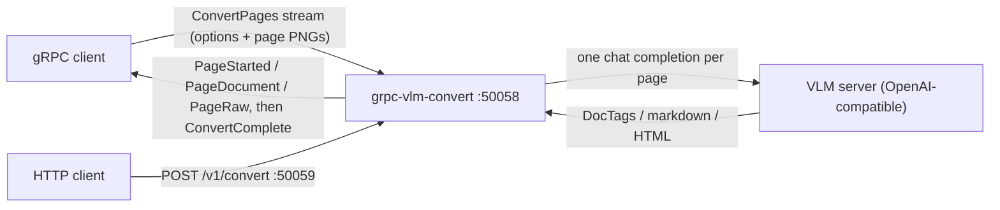

# grpc-vlm-convert

gRPC collector that parses pages with a vision-language model (VLM) and
maps the result into the pipestream document schema
(`ai.pipestream.document.v1`), as an alternate parse path for gRParse.

This repo is a spec plus a standalone C++ gRPC server. It is not
PipeStream core. The VLM itself is a separate server this binary calls
over an OpenAI-compatible HTTP endpoint; no model weights are loaded or
downloaded here.



## Build and test

Requires CMake ≥ 3.20, a C++17 compiler, and `buf` for proto lint.
gRPC, cpp-httplib, and nlohmann/json are fetched by CMake.

```sh
cmake -S . -B build -G Ninja -DCMAKE_BUILD_TYPE=Release
cmake --build build --parallel
ctest --test-dir build --output-on-failure   # golden test skips (77) without a VLM endpoint
buf lint
```

The unit and e2e tests fake the VLM HTTP endpoint in-process: no network,
no GPU. The golden test runs one real page against a live endpoint when
provisioned:

```sh
GRPC_VLM_TEST_ENDPOINT=http://localhost:8080 \
GRPC_VLM_TEST_PNG=/path/to/page.png \
  ./build/vlm-golden-test
```

## Run

```sh
GRPC_VLM_ENDPOINT=http://vlm:8080 ./build/grpc-vlm-convert-server
```

Configuration is entirely `GRPC_VLM_*` environment variables:

| Variable | Default | Meaning |
|---|---|---|
| `GRPC_VLM_LISTEN_ADDRESS` | `0.0.0.0:50058` | gRPC listen address |
| `GRPC_VLM_ENDPOINT` | *(empty)* | OpenAI-compatible VLM endpoint. Empty is legal at startup; `ConvertPages` then needs a per-request endpoint or fails `FAILED_PRECONDITION` |
| `GRPC_VLM_PRESETS` | *(all built-ins)* | Comma list of preset names the endpoint claims to serve, reported by `GetServiceInfo` |
| `GRPC_VLM_CONCURRENCY` | `2` | Pages in flight against the VLM per stream |
| `GRPC_VLM_MAX_PAGE_BYTES` | `33554432` | Per-page PNG cap (`RESOURCE_EXHAUSTED`) |
| `GRPC_VLM_MAX_PAGES` | `512` | Per-stream page cap (`RESOURCE_EXHAUSTED`) |
| `GRPC_VLM_VLM_TIMEOUT_SECONDS` | `300` | Deadline for one page's VLM call |
| `GRPC_VLM_METRICS_INTERVAL_SECONDS` | `60` | Stdout metrics line interval, 0 disables |
| `GRPC_VLM_HTTP_PORT` | `50059` | HTTP/JSON front-end port; `0` or empty disables the listener |

## HTTP API

Alongside gRPC, the same binary serves an HTTP/JSON front end on
`GRPC_VLM_HTTP_PORT`. It drives the identical ConvertPages pipeline: the
envelope is plain JSON, but every message body is canonical proto3 JSON
(protobuf `MessageToJsonString` / `JsonStringToMessage`, camelCase field
names, base64 bytes), never hand-mapped.

`POST /v1/convert` runs a whole conversion and returns every stream event
in order:

```sh
curl -s http://localhost:50059/v1/convert -d '{
  "options": {"preset": "VLM_PRESET_GOT_OCR_2"},
  "pages": [{"pageNo": 1, "png": "<base64 PNG>"}, {"pageNo": 2, "png": "<base64 PNG>"}]
}'
# → {"events": [{"pageStarted": {"pageNo": 1}}, ..., {"pageDocument": {...}}, ...,
#    {"complete": {"pagesStarted": 2, "pagesOk": 2}}]}
```

Errors keep the gRPC matrix: 400 on `INVALID_ARGUMENT` (bad JSON, page_no
0, non-PNG bytes), 413 on `RESOURCE_EXHAUSTED`, 501 on `UNIMPLEMENTED`
(PDF input), 500 otherwise. The body still carries the events collected
before the failure plus an `error` object:

```json
{"events": [...], "error": {"code": "ABORTED", "message": "abort_on_error set and 1 page(s) failed"}}
```

`POST /v1/convert/stream` takes the same request body and answers with
chunked NDJSON: one `ConvertPagesResponse` as proto3 JSON per line,
flushed the moment the pipeline produces it, so HTTP callers see the same
live per-page events gRPC clients get, in completion order. A mid-stream
failure ends the body with one `{"error": ...}` line:

```sh
curl -sN http://localhost:50059/v1/convert/stream -d '{"options": {}, "pages": [...]}'
# {"pageStarted":{"pageNo":1}}
# {"pageDocument":{"pageNo":1,"document":{...}}}
# {"complete":{"pagesStarted":1,"pagesOk":1}}
```

`GET /healthz` returns `200 ok`.

## gRPC stream

Clients stream `ConvertPagesRequest` (one `ConvertOptions`, then one
`PageImage` PNG per page) and receive `PageStarted` / `PageDocument` /
`PageRaw` events per page in completion order: a page is emitted the
moment its VLM call returns, out-of-order pages are legal and key on
`page_no`. A `ConvertComplete` trailer closes the stream. Health
(`grpc.health.v1.Health`) and server reflection are registered.

Docker: `docker build -t grpc-vlm-convert .` The build stage runs the
test suite and gates the image; the runtime is diskless (`--read-only`).

## Start here (humans and LLMs)

1. [`AGENTS.md`](AGENTS.md): read order, definition of done, git
2. [`docs/architecture.md`](docs/architecture.md): where this sits, language, live stream
3. [`docs/design.md`](docs/design.md): wire API, Document mapping, tests
4. [`docs/guidelines.md`](docs/guidelines.md): fleet rules (streaming, proto, diskless, git)

Copy operational patterns from `/work/main/grpc-services/gRParse`
(Document, page stream). Prompt and response-shape behavior is specified
in `docs/design.md` and pinned by the tests.

## Remotes

- **Forgejo** (`git.rokkon.com/ai-pipestream/grpc-vlm-convert`) is the source of truth. `main` lives here.
- **GitHub** is a public push-mirror of `main`. Do not merge to GitHub `main`.
- GitHub's default branch is `development` so LLM / `gh` work lands there instead of clobbering the mirror.

Push Forgejo first. GitHub `main` updates from the Forgejo push-mirror.
