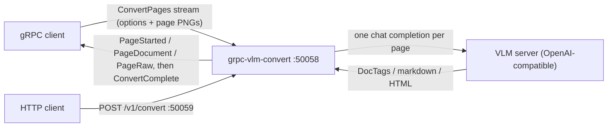

# grpc-vlm-convert

gRPC collector that parses pages with a vision-language model (VLM) and
maps the result into the pipestream document schema
(`ai.pipestream.document.v1`), as an alternate parse path for gRParse.

This repo is a spec plus a standalone C++ gRPC server. It is not
PipeStream core. The VLM itself is a separate server this binary calls
over an OpenAI-compatible HTTP endpoint; no model weights are loaded or
downloaded here.


```mermaid
flowchart LR
    client["gRPC client"] -->|"ConvertPages stream (options + page PNGs)"| server["grpc-vlm-convert :50058"]
    http["HTTP client"] -->|"POST /v1/convert :50059"| server
    server -->|"one chat completion per page"| vlm["VLM server (OpenAI-compatible)"]
    vlm -->|"DocTags / markdown / HTML"| server
    server -->|"PageStarted / PageDocument / PageRaw, then ConvertComplete"| client
```

## Build and test

Requires CMake ≥ 3.20, a C++17 compiler, and `buf` for proto lint.
gRPC, cpp-httplib, and nlohmann/json are fetched by CMake.

```sh
cmake -S . -B build -G Ninja -DCMAKE_BUILD_TYPE=Release
cmake --build build --parallel
ctest --test-dir build --output-on-failure   # golden test skips (77) without a VLM endpoint
buf lint
```

The unit and e2e tests fake the VLM HTTP endpoint in-process: no network,
no GPU. The golden test runs one real page against a live endpoint when
provisioned:

```sh
GRPC_VLM_TEST_ENDPOINT=http://localhost:8080 \
GRPC_VLM_TEST_PNG=/path/to/page.png \
  ./build/vlm-golden-test
```

## Run

```sh
GRPC_VLM_ENDPOINT=http://vlm:8080 ./build/grpc-vlm-convert-server
```

Configuration is entirely `GRPC_VLM_*` environment variables:

| Variable | Default | Meaning |
|---|---|---|
| `GRPC_VLM_LISTEN_ADDRESS` | `0.0.0.0:50058` | gRPC listen address |
| `GRPC_VLM_ENDPOINT` | *(empty)* | OpenAI-compatible VLM endpoint, `http://` only: a base (`http://vlm:8080`, an optional path prefix allowed) gets `/v1/chat/completions` appended, an OpenAI-style base ending in `/v1` gets `/chat/completions`, and a full `.../chat/completions` URL (Docling's `ApiVlmOptions.url`) is used as is; a query string rides along. No `user:password@` part. Checked at startup. Logs, errors and `GetServiceInfo` show only its scheme, host and port, never its path or query. Empty is legal at startup; `ConvertPages` then fails `FAILED_PRECONDITION` unless overrides are allowed and the request names an endpoint |
| `GRPC_VLM_API_KEY` | *(empty)* | Bearer key for the configured endpoint, sent as `Authorization: Bearer <key>`. Never logged, returned or echoed, and never sent to an endpoint a request named. It crosses the network in clear text over `http://`: keep the VLM on a trusted network or behind a TLS proxy |
| `GRPC_VLM_ALLOW_ENDPOINT_OVERRIDE` | `false` | `true` lets `ConvertOptions.endpoint` point a stream at another endpoint. Off, a request naming any endpoint other than the configured one fails `PERMISSION_DENIED`: an override lets every caller make this server POST to any host it can reach and read the answer back |
| `GRPC_VLM_PRESETS` | *(all built-ins)* | Comma list of preset names the endpoint claims to serve, reported by `GetServiceInfo`. Built-ins: `smoldocling`, `granite-docling`, `got-ocr-2`, `granite-vision`, `deepseek-ocr`, `nanonets-ocr2`, `glm-ocr`, `lighton-ocr`, `north-micro-vision` (see `serving/north-micro-vision/` for an open-source endpoint that serves the last one on NVIDIA, Intel XPU or CPU) |
| `GRPC_VLM_CONCURRENCY` | `2` | Pages in flight against the VLM per stream (all streams together are capped by `GRPC_VLM_MAX_INFLIGHT`) |
| `GRPC_VLM_MAX_INFLIGHT` | `8` | VLM calls in flight across every stream: the endpoint's capacity is per server, not per stream. A call past it waits here, its timeout not yet running |
| `GRPC_VLM_MAX_PAGE_BYTES` | `33554432` | Per-page PNG cap (`RESOURCE_EXHAUSTED`) |
| `GRPC_VLM_MAX_PAGES` | `512` | Per-stream page cap (`RESOURCE_EXHAUSTED`) |
| `GRPC_VLM_MAX_STREAM_BUFFERED_BYTES` | 4 × `GRPC_VLM_MAX_PAGE_BYTES` | Bytes of page images one stream may hold read but not yet answered (queued or in flight). At the cap the server stops reading that stream, so gRPC flow control holds the client back. At least `GRPC_VLM_MAX_PAGE_BYTES` |
| `GRPC_VLM_MAX_BUFFERED_BYTES` | 16 × `GRPC_VLM_MAX_PAGE_BYTES` | The same bound across every stream on both transports. At least `GRPC_VLM_MAX_PAGE_BYTES` |
| `GRPC_VLM_VLM_TIMEOUT_SECONDS` | `300` | Wall-clock budget for one page's whole VLM call: every attempt and every retry backoff spend from it, and an endpoint that drips bytes cannot stretch it. A cancelled stream or an expired client deadline ends the call sooner, mid-attempt included |
| `GRPC_VLM_METRICS_INTERVAL_SECONDS` | `60` | Stdout metrics line interval, 0 disables |
| `GRPC_VLM_HTTP_PORT` | `50059` | HTTP/JSON front-end port; `0` or empty disables the listener |
| `GRPC_VLM_HTTP_HOST` | `127.0.0.1` | Address the HTTP front end binds. Any non-loopback host (`0.0.0.0` in a container) requires `GRPC_VLM_HTTP_TOKEN`, or the server refuses to start |
| `GRPC_VLM_HTTP_TOKEN` | *(empty)* | Bearer token every HTTP convert request must carry (`Authorization: Bearer <token>`); `/healthz` stays open. Wrong or missing is 401, checked before the body is read. Never logged |
| `GRPC_VLM_HTTP_MAX_BODY_BYTES` | `67108864` | Largest HTTP request body; a larger one is 413 before more than this is read. The front end holds a request several times over (body, JSON, protobuf), so this bounds its memory per request: send big documents over gRPC |

## HTTP API

Alongside gRPC, the same binary serves an HTTP/JSON front end on
`GRPC_VLM_HTTP_HOST`:`GRPC_VLM_HTTP_PORT`, loopback by default (any other
host needs `GRPC_VLM_HTTP_TOKEN`, sent as `Authorization: Bearer
<token>`). It drives the identical ConvertPages pipeline: the
envelope is plain JSON, but every message body is canonical proto3 JSON
(protobuf `MessageToJsonString` / `JsonStringToMessage`, camelCase field
names, base64 bytes), never hand-mapped.

`POST /v1/convert` runs a whole conversion and returns every stream event
in order:

```sh
curl -s http://localhost:50059/v1/convert -d '{
  "options": {"preset": "VLM_PRESET_GOT_OCR_2"},
  "pages": [{"pageNo": 1, "png": "<base64 PNG>"}, {"pageNo": 2, "png": "<base64 PNG>"}]
}'
# → {"events": [{"pageStarted": {"pageNo": 1}}, ..., {"pageDocument": {...}}, ...,
#    {"complete": {"pagesStarted": 2, "pagesOk": 2}}]}
```

Errors keep the gRPC matrix: 400 on `INVALID_ARGUMENT` (bad JSON, page_no
0, non-PNG bytes), 401 on a missing or wrong token, 403 on
`PERMISSION_DENIED` (an endpoint override the server does not allow), 413
on `RESOURCE_EXHAUSTED` or a body over `GRPC_VLM_HTTP_MAX_BODY_BYTES`, 501
on `UNIMPLEMENTED`
(PDF input), 500 otherwise. The body still carries the events collected
before the failure plus an `error` object:

```json
{"events": [...], "error": {"code": "ABORTED", "message": "abort_on_error set and 1 page(s) failed"}}
```

`POST /v1/convert/stream` takes the same request body and answers with
chunked NDJSON: one `ConvertPagesResponse` as proto3 JSON per line,
flushed the moment the pipeline produces it, so HTTP callers see the same
live per-page events gRPC clients get, in completion order. A mid-stream
failure ends the body with one `{"error": ...}` line:

```sh
curl -sN http://localhost:50059/v1/convert/stream -d '{"options": {}, "pages": [...]}'
# {"pageStarted":{"pageNo":1}}
# {"pageDocument":{"pageNo":1,"document":{...}}}
# {"complete":{"pagesStarted":1,"pagesOk":1}}
```

A caller that hangs up stops its conversion on either route: queued pages
are skipped and the VLM call in flight is cut, so nothing more is paid for.

`GET /healthz` returns `200 ok`.

## gRPC stream

Clients stream `ConvertPagesRequest` (one `ConvertOptions`, then one
`PageImage` PNG per page) and receive `PageStarted` / `PageDocument` /
`PageRaw` events per page in completion order: a page is emitted the
moment its VLM call returns, out-of-order pages are legal and key on
`page_no`. A `PageDocument` lists anything cut to a server cap as typed
`PageWarning`s beside its fragment (a table past the row, column or cell
caps, ...). A `ConvertComplete` trailer closes the stream. Health
(`grpc.health.v1.Health`) and server reflection are registered.
`GetServiceInfo` also carries a `UiInfo` block (title, path,
description) advertising this service's tab to the shared demo shell.

Docker: `docker build -t grpc-vlm-convert .` The build stage runs the
test suite and gates the image; the runtime is diskless (`--read-only`).

## Start here (humans and LLMs)

1. [`AGENTS.md`](AGENTS.md): read order, definition of done, git
2. [`docs/architecture.md`](docs/architecture.md): where this sits, language, live stream
3. [`docs/design.md`](docs/design.md): wire API, Document mapping, tests
4. [`docs/guidelines.md`](docs/guidelines.md): fleet rules (streaming, proto, diskless, git)

Copy operational patterns from `/work/main/grpc-services/gRParse`
(Document, page stream). Prompt and response-shape behavior is specified
in `docs/design.md` and pinned by the tests.

## Remotes

- **Forgejo** (`git.rokkon.com/ai-pipestream/grpc-vlm-convert`) is the source of truth. `main` lives here.
- **GitHub** is a public push-mirror of `main`. Do not merge to GitHub `main`.
- GitHub's default branch is `development` so LLM / `gh` work lands there instead of clobbering the mirror.

Push Forgejo first. GitHub `main` updates from the Forgejo push-mirror.
