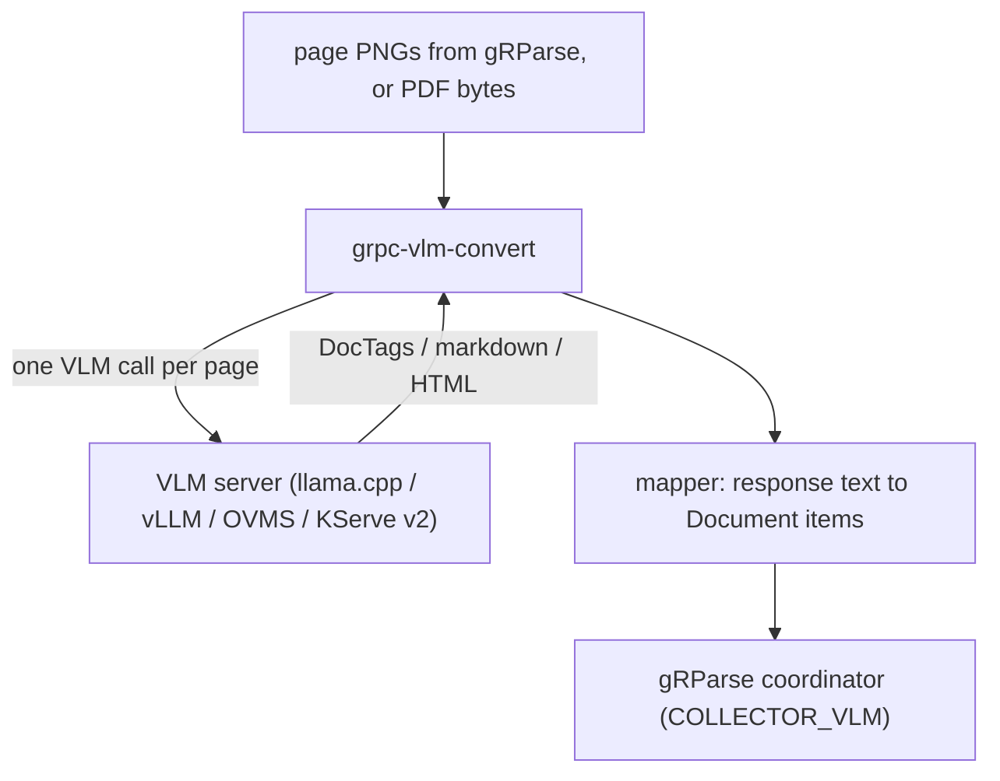

# grpc-vlm-convert architecture

**Status:** implemented (v1 server in `src/`, tests in `tests/`)
**Updated:** 2026-08-13

Implementers start at [`AGENTS.md`](../AGENTS.md), then this file, `design.md`, and `guidelines.md`.

## Where this sits

A VLM page parse is an alternate parse of PDF and images: a
vision-language model reads the page and emits DocTags, markdown, or
HTML, which this service maps into the pipestream document schema
(`ai.pipestream.document.v1`). That is not enrichment (enrichment
annotates an already-parsed document) and not the default CV convert
(Heron + RapidOCR + TableFormer).

This service runs that parse over gRPC, without torch in gRParse.

gRParse's default path stays CV. Clients opt into this collector
explicitly (`collectors += VLM`) or by `pipeline = VLM`. Running both
is legal: sources do not overwrite.

## Live results

A batch VLM convert waits until every page has been through the model,
then returns one document. This service emits a **`PageDocument` as soon
as that page's VLM call returns**, tagged with `page_no`. A UI can paint
page 1 (or page 4, if it finished first) without waiting for the rest.
Pages may complete out of order; the coordinator and the UI key on
`page_no`. `ConvertComplete` is a trailer, not the payload.

## What this process owns

- Turning pages into model inputs: rasterize if given a PDF, or accept
  PNGs the coordinator already rendered. Prefer the latter so Poppler
  stays in gRParse.
- Talking to a VLM server: llama.cpp, OpenVINO GenAI / OVMS, vLLM
  OpenAI-compat, or KServe v2. **This binary does not load
  transformers.**
- Parsing the model's response format (DocTags, markdown, HTML, OTSL,
  plaintext) into `Document` items with page provenance.
- Streaming per page as soon as that page's VLM call returns.

## What this process does not own

| Concern | Owner |
|---|---|
| Default layout / OCR / tables / barcodes | gRParse CV |
| Picture describe after a CV parse | `grpc-enrich` |
| Training or fine-tuning VLM models | upstream |
| Markdown file export | protomolt sink |

## Language

C++ mapper plus an HTTP/gRPC client to the VLM. Raster reuse from
gRParse (PNG bytes on the request) so we do not add a second Poppler.
If the client sends a PDF, a small PDFium/Poppler path is allowed but
should be the exception.

No Python serving path. Prompts and response shapes are specified in
`design.md` and pinned by the tests.

## Hardware

VRAM lives in the VLM server, not here. This process is CPU-bound on
mapping. That is the point: gRParse OCR pools and a 27 B Gemma do not
share a device.
